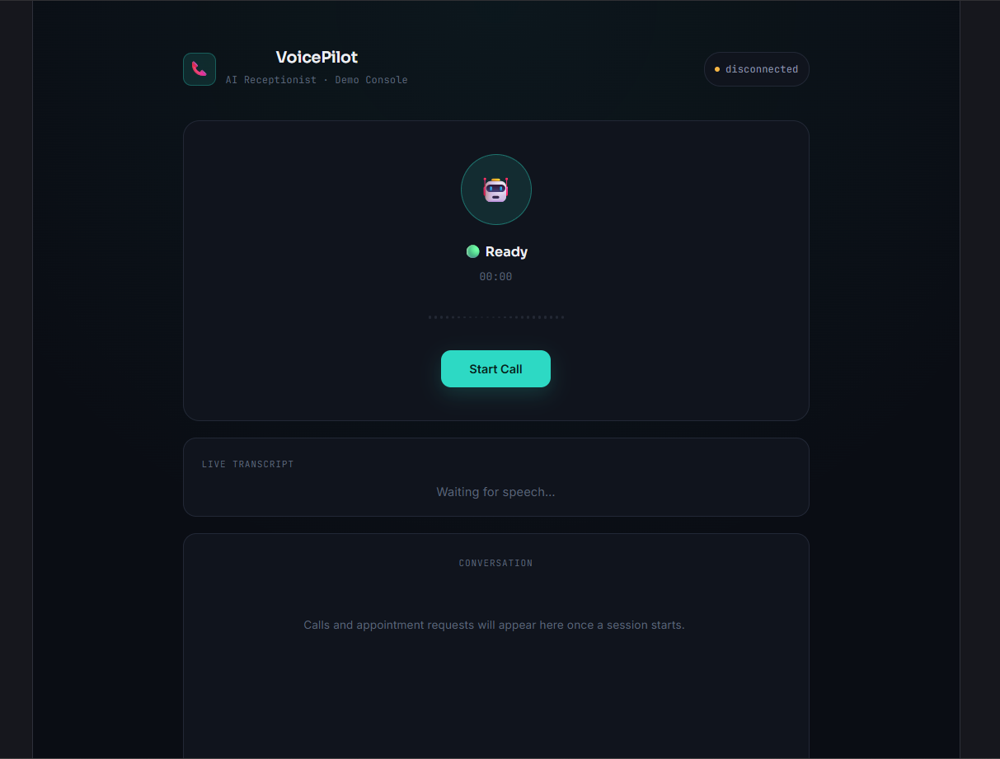
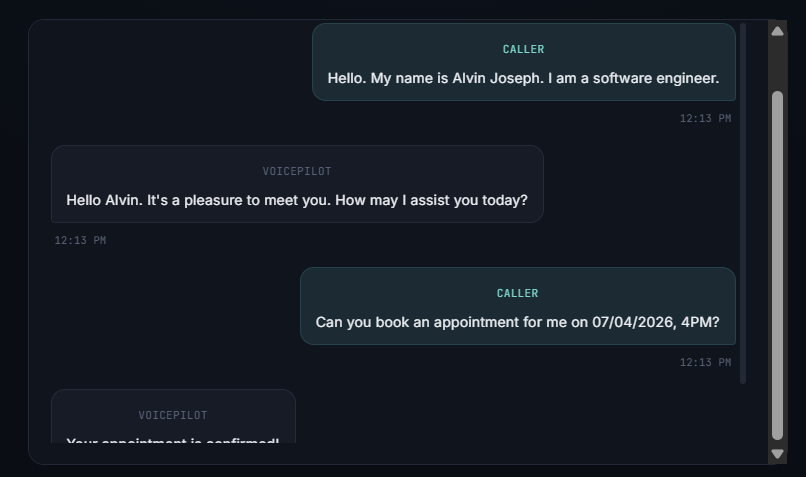
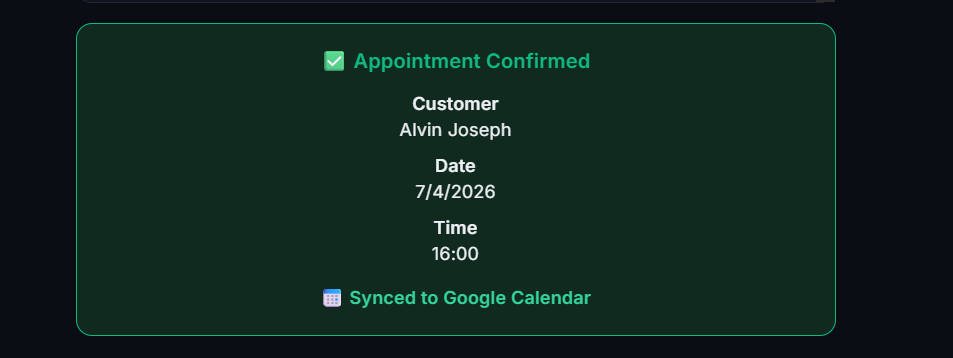
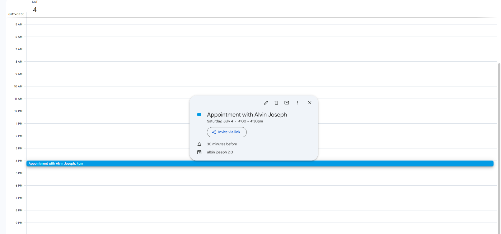

# 🎙️ VoicePilot AI

**A Real-Time AI Voice Receptionist powered by FastAPI, React, Gemini, Deepgram, Redis, ElevenLabs & Google Calendar**

---

## 🚀 Overview

VoicePilot AI is a full-stack AI voice receptionist that enables natural spoken conversations with an AI assistant.

The system streams microphone audio to a FastAPI backend, converts speech to text using Deepgram, reasons with Gemini, stores conversation memory in Redis, books appointments using Google Calendar, generates natural speech using ElevenLabs, and streams audio back to the client.

The current implementation uses a **React Web Client**. The backend is designed to support **Twilio Media Streams** in the future for real phone calls.

---

# 📦 Project Repositories

| Repository | Description |
|------------|-------------|
| **Backend** | FastAPI backend implementing WebSockets, Deepgram, Gemini, Redis, Tool Calling, ElevenLabs and Google Calendar |
| **Frontend (Web Client)** | React + TypeScript client showcasing the complete voice workflow |

### Backend Repository

https://github.com/albiejodev/VoicePilot-AI_Backend

### Frontend Repository

https://github.com/albiejodev/VoicePilot-AI_Frontend

---

# 🛠 Technology Stack

- React
- TypeScript
- FastAPI
- Python
- WebSockets
- Deepgram
- Gemini 2.5 Flash
- Redis
- ElevenLabs
- Google Calendar API
- Docker

---

# ✨ Features

- ✅ Real-time voice conversations
- ✅ Live Speech-to-Text
- ✅ AI conversation memory
- ✅ Google Calendar appointment booking
- ✅ ElevenLabs speech synthesis
- ✅ Tool Calling
- ✅ Live transcript streaming
- 🚧 Twilio Media Streams (planned)

--- 
# 🏗 System Architecture

```text
React Web Client
        │
    WebSocket
        │
        ▼
 FastAPI Backend
        │
 ┌──────┼───────────┐
 ▼      ▼           ▼
Deepgram Gemini   Redis
        │
        ▼
 Tool Executor
        │
 ┌──────┴─────────┐
 ▼                ▼
Google Calendar ElevenLabs
        │
        ▼
 Browser Speaker

Future:
Twilio Media Streams
```

---
## Demo Video


# 📸 Screenshots

## Home Dashboard



## Live Conversation



## Appointment Booking



## Google Calendar Event



---

# 🎬 Demo Video

Add your YouTube or Loom link here.

---

# 📂 Repository Structure

```text
VoicePilot-AI/
├── README.md
└── docs/
    ├── images/
    ├── architecture.png
    ├── sequence-diagram.png
    └── demo.gif
```

---

# 🚀 Quick Start

1. Clone the backend repository.
2. Follow the backend setup guide.
3. Clone the frontend repository.
4. Start Redis.
5. Run the backend.
6. Run the frontend.

---

# 💡 Why This Project?

VoicePilot AI demonstrates how modern conversational AI systems combine streaming speech, LLM reasoning, memory, external tool execution and speech synthesis into a seamless real-time experience.

---

# 📚 Challenges & Learnings

- Streaming audio over WebSockets
- Async FastAPI workflows
- Redis session memory
- Google Calendar OAuth
- AI tool calling
- Multi-provider AI orchestration

---

# 🛣 Future Roadmap

- Twilio Media Streams
- RAG Knowledge Base
- CRM Integration
- Human Handoff
- Email/SMS confirmations
- Analytics Dashboard

---

# 📄 License

MIT
